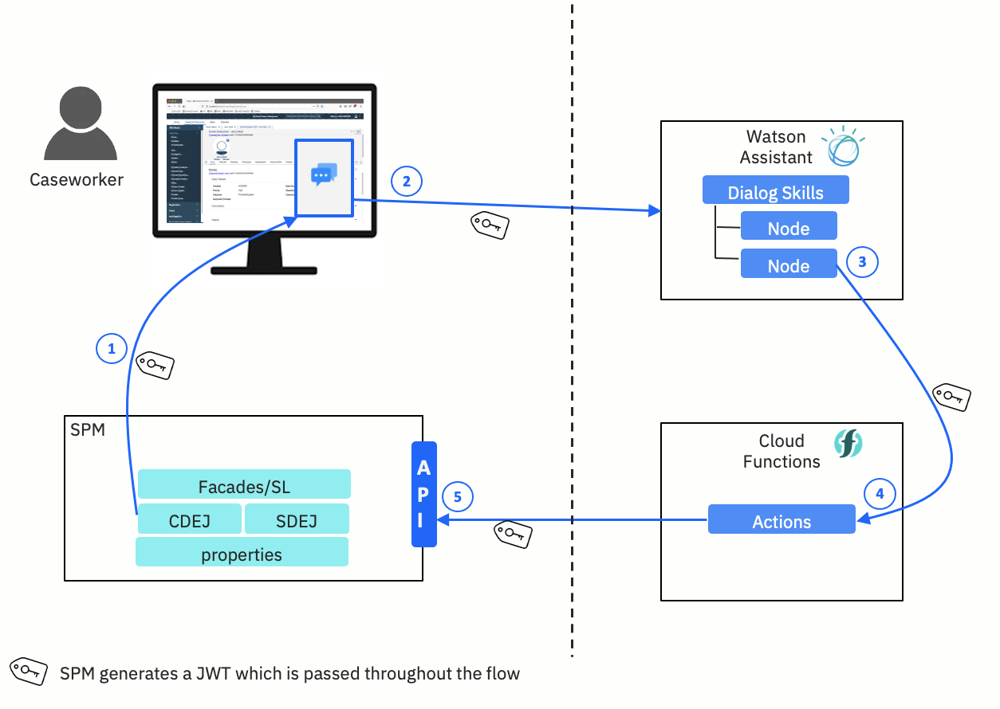

---
title: Architecture overview
description: Architecture overview
--- 

Merative Social Program Management supports secure integration with the IBM Watson™ Assistant. If enabled, communication between Social Program Management and Watson Assistant is secured by using a JSON Web Token (JWT).

A chat widget, which can be configured to connect to an instance of Watson Assistant, is included as an option in the caseworker application screens.

A JWT is required for both outbound and inbound requests between Social Program Management and Watson Assistant.

The Social Program Management application generates and signs a JWT for the logged in user, and adds it to each outbound request to Watson Assistant.
This JWT is passed along to IBM Cloud Functions, and added to each inbound REST API request back into SPM. The application server will validate the JWT on incoming requests. Secure access using JWT is only applicable to internal users.

Ant build scripts are provided in SPM to generate a keystore, a self-signed certificate and public key certificate file.
These may be replaced with a certificate signed by a Trusted Authority in production environments.
The signer certificate is used for both signing the JWT in the outbound requests, and for verifying the JWT on the incoming requests from Watson Assistant.

For more information, see [Integrating with Watson Assistant](https://www.ibm.com/docs/spm/8.0.0?topic=applications-integrating-watson-assistant).

The following figure outlines the flow of the integration with Social Program Management and Watson Assistant.  

<Caption fullWidth>

*Figure 1: Watson Assistant integration with Social Program Management.*

</Caption>

The following list outlines the illustrated steps:

1. The web chat is embedded in SPM.
2. The Watson Assistant properties are configured in SPM to point at a Watson Assistant instance.
3. The skills dialog node in Watson Assistant calls an action in IBM Cloud Functions.
4. The action in IBM Cloud Functions makes API calls to SPM to retrieve data.
5. Data from the response is returned in conversation in the web chat window.
