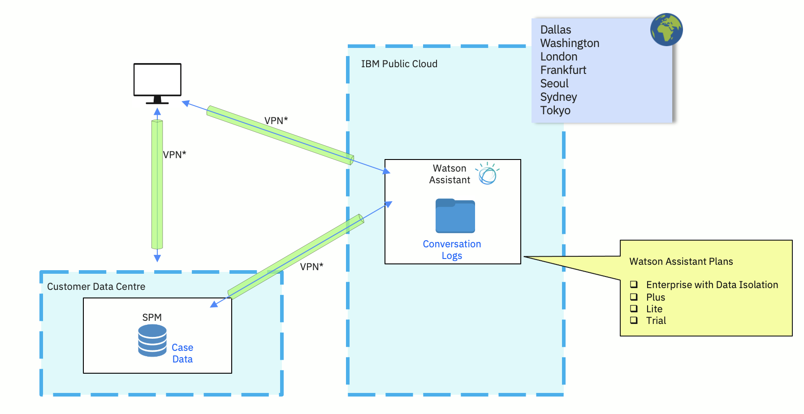
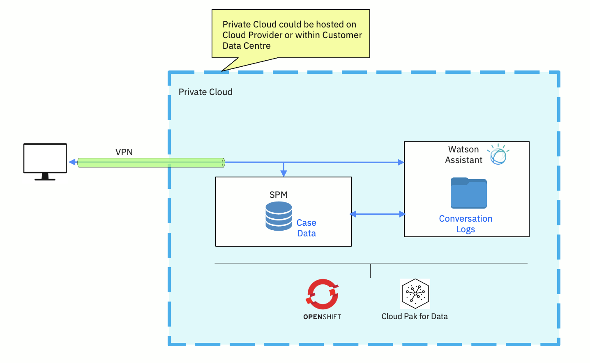

## Option 1: IBM Watson™ Assistant as Service on IBM public cloud

The following figure outlines the first option for deploying IBM Watson™ Assistant as a Service on IBM public cloud. Where needed and decided by the customer, a virtual private network (VPN) can be included.

The following list outlines the possible challenges that are associated with this option:

1. It might require data to be shared outside the country or state.
2. The case data is logged in Watson Assistant as it is a public cloud.

<Caption fullWidth>

*Figure 1: IBM Watson Assistant as Service on IBM public cloud.*

</Caption>

## Option 2a: IBM Watson™ Assistant in private cloud

The following figure outlines the option where you can deploy Watson Assistant in a private cloud that is either hosted by a cloud provider or within the customer’s own data center.

<Caption fullWidth>

*Figure 2: IBM Watson™ Assistant in private cloud.*

</Caption>

For further information about how to deploy Watson Assistant in a private cloud, see the [Cartridges for IBM Cloud Pak for Data](https://www.ibm.com/products/cloud-pak-for-data/cartridges).  

## Option 2b: IBM Watson™ Assistant in private cloud (co-deployed with SPM)

This is similar to the preceding option, except that Watson Assistant is  co-deployed with SPM in a private cloud that is either hosted by a cloud provider or within the customer’s own data center.

Therefore, you don’t need a VPN for the interactions between Watson Assistant and SPM. The following figure shows how SPM could be deployed on OpenShift as well.

<Caption fullWidth>

*Figure 3: IBM Watson™ Assistant in private cloud (co-deployed with SPM).*

</Caption>

For further information about how to deploy Watson Assistant in a private cloud, see [Cartridges for IBM Cloud Pak for Data](https://www.ibm.com/products/cloud-pak-for-data/cartridges).
