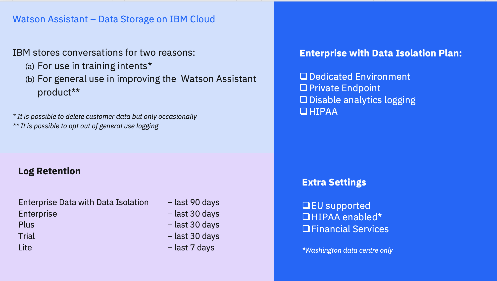

The following figure provides a brief overview of the data storage reasons, the log retention storage limits, the data isolation plans, and the extra settings available.

<Caption fullWidth>

*Figure 1: IBM Watson™ Assistant data storage.*

</Caption>

The following list outlines further information about data storage by IBM Watson™ Cloud:

* [Data handling](https://cloud.ibm.com/apidocs/assistant-v2#data-handling).
* [Information security](https://cloud.ibm.com/docs/assistant?topic=assistant-information-security).
* [Enabling EU support for your account](https://cloud.ibm.com/docs/account?topic=account-eu-supported#eu-hipaa-supported).
