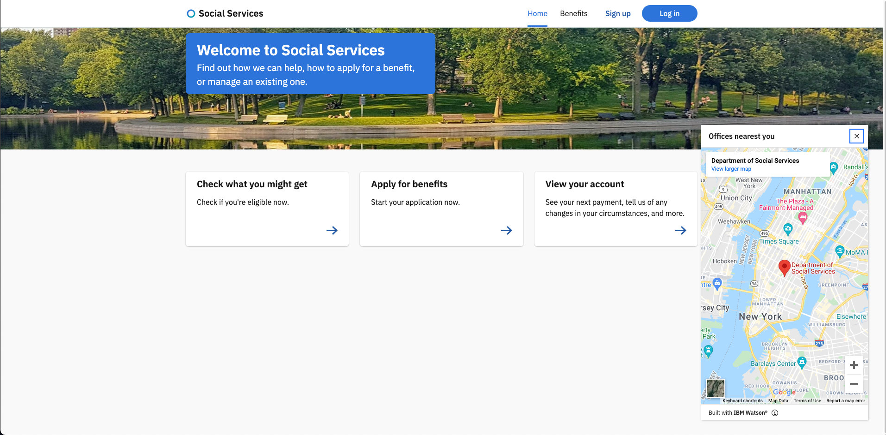

## Google Maps

The Watson Assistant web chat widget has a feature to display an embedded iframe as a hyperlink, which then expands once clicked upon to display any given map.  The default map chosen for the asset is Google Maps.  In order to use the same dialog node as is, you must obtain your own Google API Key and update the node "Map Office By Zip Code".

1. Obtain a Google Maps API Key as specified in this link:  [API Key](https://developers.google.com/maps/documentation/javascript/get-api-key)
2. From Watson Assistant, find the dialog node `Map Office by Zip Code`
3. Update the context variable `mapApiKey` with the API key you obtained from the first step.
5. Optionally, update the `mapQuery` context variable as required.  The default map query is `Department+Social+Services`. 

