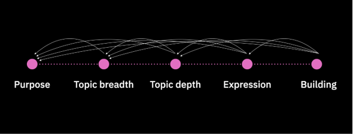
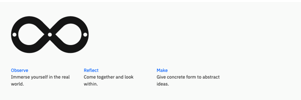
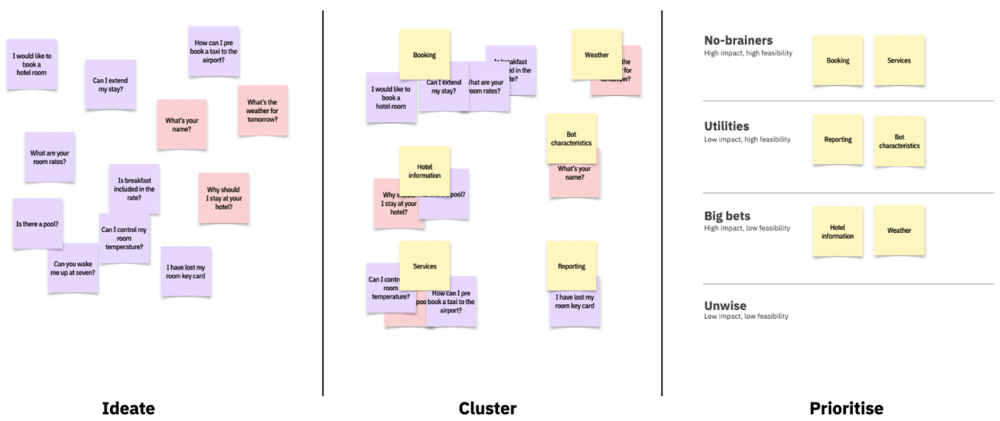
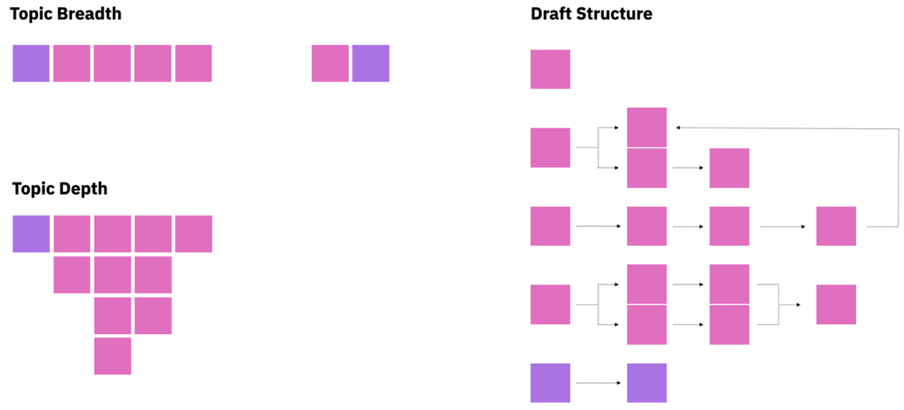
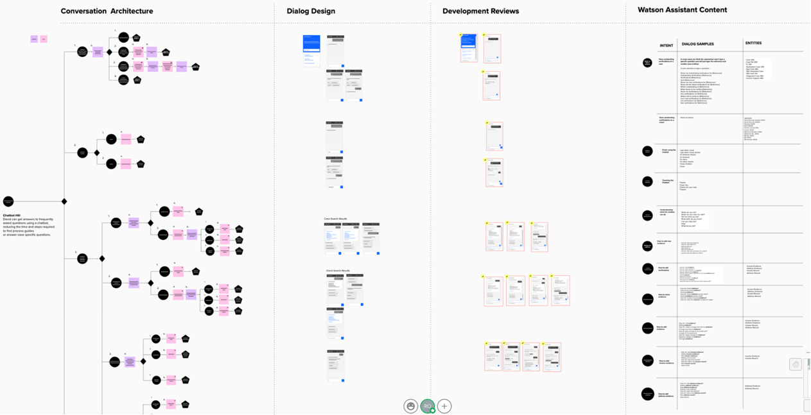
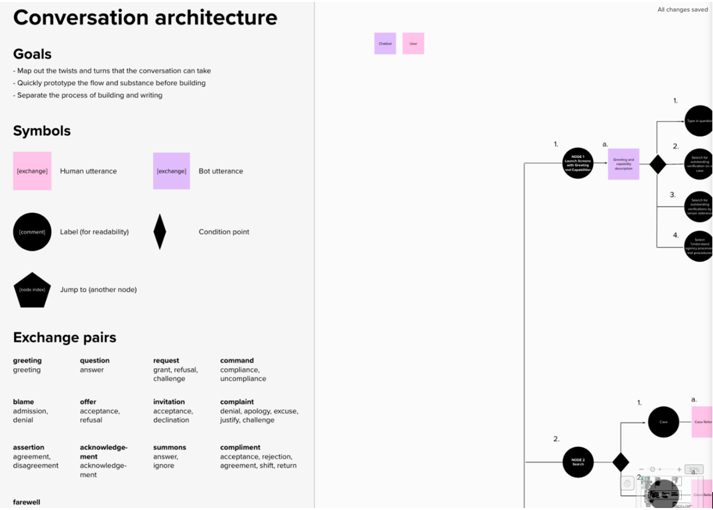
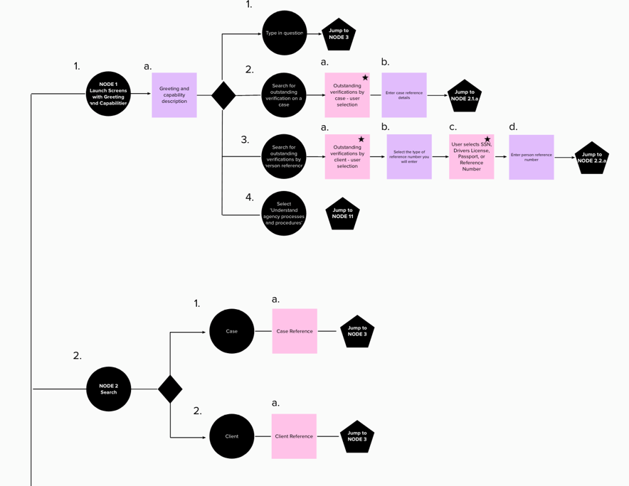
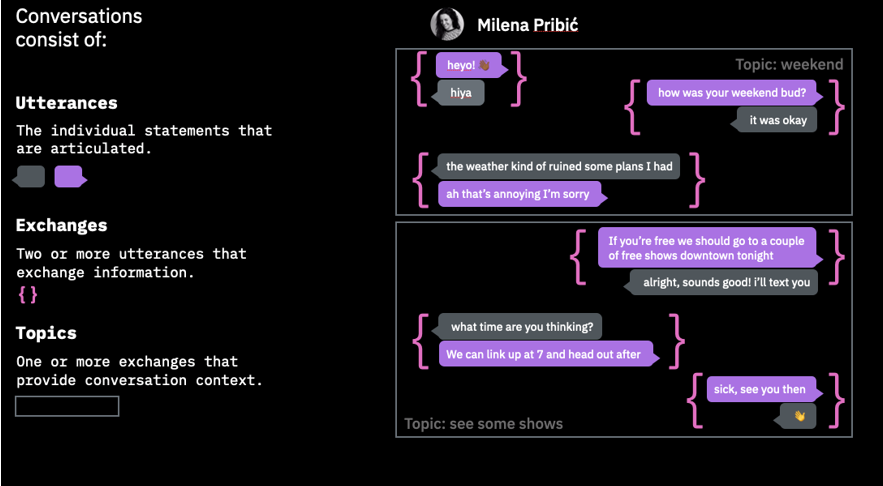
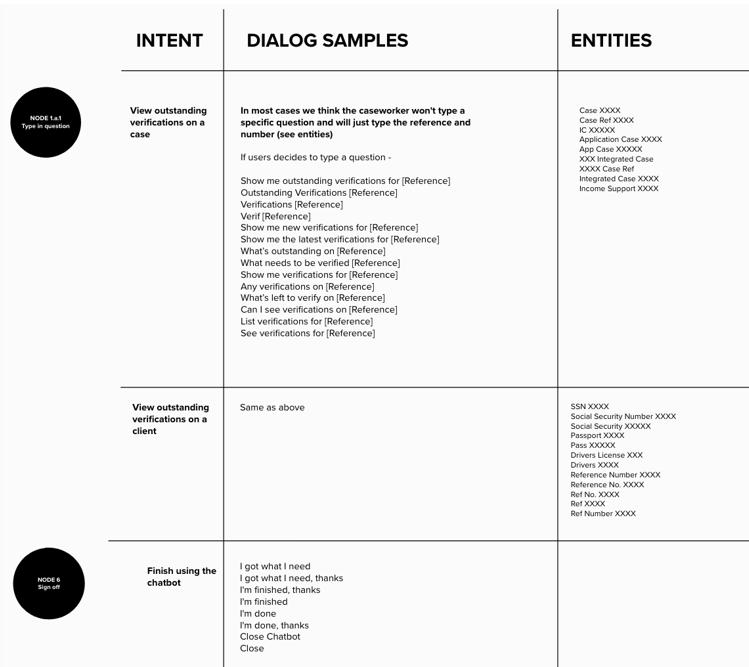
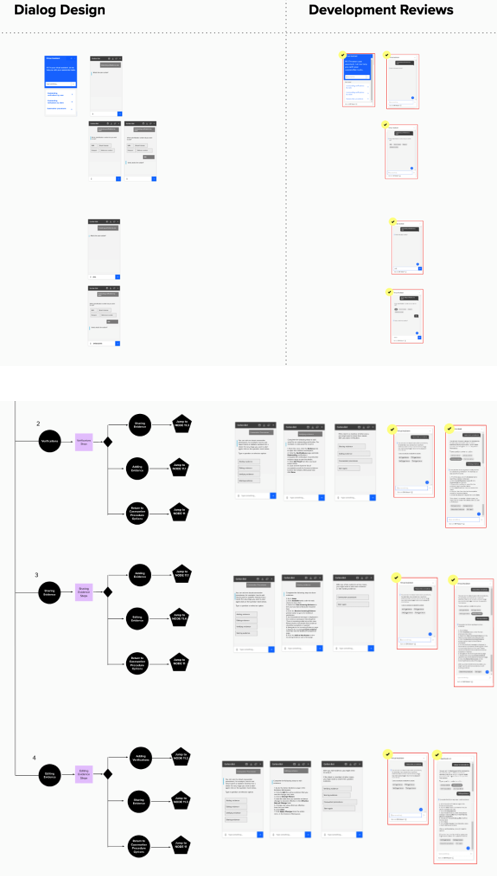

<u>Table of Contents</u>

* [Designing chatbots](#designing-chatbots)
  * [Purpose](#purpose)
  * [Topic breadth](#topic-breadth)
  * [Topic depth](#topic-depth)
  * [Expression](#expression)
  * [Building the chatbot](#building-the-chatbot)
    * [Conversation architecture](#conversation-architecture)
    * [Dialog design](#dialog-design)
    * [Defining the dialog](#defining-the-dialog)
    * [Watson Assistant content](#watson-assistant-content)
    * [Development reviews](#development-reviews)
  * [Ensuring a great user experience](#ensuring-a-great-user-experience)

## Designing chatbots

"A computer program designed to have a conversation with a human being, especially over the internet."

[https://dictionary.cambridge.org/dictionary/english/chatbot](https://dictionary.cambridge.org/dictionary/english/chatbot)

A successful chatbot or conversation agent needs to build an effective relationship between the human being and the computer program. It needs to listen, understand, act, and learn to meet the users' outcomes.

The following list outlines the recommended steps to achieve this:

* **Purpose:** understanding the user problem that you are trying to solve with the chatbot.
* **Topic breadth:** the breadth of topics that you want the chatbot to be able to converse about.
* **Topic depth:** within those topics, the level of detail that you want the chatbot to cover.
* **Expression:** defining the personality of your chatbot.
* **Building the chatbot:** mapping the flow and content of the chatbot, and defining the conversation architecture.

These steps are not linear. You are learning and iterating throughout the process, so you move back and forth between each step.

<Caption fullWidth>

*Figure 1: Steps for designing a chatbot, IBM Design for Artificial Intelligence, Sept 2019, Lawrence Humphrey.*

</Caption>

### Purpose

First, you must establish the purpose of the chatbot. This defines the problem that the chatbot is solving and the functions it is providing.

Before you design, make sure that you are not implementing a chatbot just because the technology exists.
Use a chatbot only if it can accomplish your project goals with better user and business outcomes than traditional methods, and if the implementation of a natural or guided conversation is likely to provide a better experience

The following list outlines the questions that IBM Design recommends asking:

* What is the user’s goal?
* How in-depth is the assistance that the user will need?
* Is it better to provide human assistance to your domain?
* How is a bot superior to "x"  that is, online documentation, contextual support, wizards, and so on..

[https://www.ibm.com/design/ai/conversation/planning](https://www.ibm.com/design/ai/conversation/planning)

To determine the purpose of your chatbot, use the activities that are outlined in the IBM’s Enterprise Design Thinking Framework. For more information, see [Enterprise Design Thinking](https://www.ibm.com/design/thinking/).

Focus on your users. Observe them to understand their goals, tasks, and frustrations. Analyze the type of data that is available to use in your chatbot and then create Hills to align your team on the user and business outcomes you plan to provide.

<Caption fullWidth>

*Figure 2: Enterprise Design Thinking.*

</Caption>

### Topic breadth

After you determine the high-level purpose of your chatbot, define the bots Minimum Viable Knowledge (MVK).
When you are designing your first chatbot, it’s best to keep this simple and try not to be overly ambitious.
The MVK lists the topics that need to be covered (topic breadth) and the depth of information in each of these topic (topic depth).

Based on your research, list  the topics that you think your bot should cover. You can run these as Design Thinking workshops by bringing your team together to ideate, cluster, and prioritize the topics that should be included.

For example, if you design a chatbot for a grocery store you might cover topics such as locations, opening hours, this week’s deals, and so on. The fewer and more focused your topics, the more likely that your chatbot succeeds.

<Caption fullWidth>

*Figure 3: Team Essential for AI – Enterprise Design Thinking.*

</Caption>

Team Essential for AI – Enterprise Design Thinking [https://www.ibm.com/design/thinking/page/badges/ai](https://www.ibm.com/design/thinking/page/badges/ai)

### Topic depth

After you agree on the breadth of your topics, you need to focus on the level of detail that you want to cover within them. With each topic, you must explore all possible paths that the user might take in conversation until it meets its natural conclusion.

You also need to include common exchanges, such as when a chatbot doesn’t understand the question or what happens if an error occurs.

It’s best to start with a happy path and then add new branches of conversation as you explore the twist and turns in the interaction between the user and the bot.

<Caption fullWidth>

*Figure 4: Topic Breadth and Depth, IBM Design for Artificial Intelligence, Sept 2019, Lawrence Humphrey.*

</Caption>

### Expression

Expression is designing the chatbot's personality. The personality of the chatbot needs to closely align to the brand of your solution. There are multiple ways to come up with the personality for your chatbot.

The following list outlines the questions that IBM Design suggests that you ask:

* How social is it?
* How open and up front is it?
* How agreeable is it?
* How thoughtful is it?
* How moody is it?
* How excitable is it?
* How professional is it?
* What kind of character is it?
* How would it react in negative or hostile situation?
* What medium will it use?
* What is it not like?

[https://www.ibm.com/design/ai/conversation/planning](https://www.ibm.com/design/ai/conversation/planning)

Understanding the personality of the chatbot enables you to use the imaginary voice that the chatbot will have in the design of your conversation.

### Building the chatbot

The following list outlines the steps to define the interaction and conversation design of your chatbot:

* Conversation architecture.
* Dialog design.
* Watson Assistant content.
* Development reviews.

You can use different tools to define the design of your chatbot. One way is to build a template in Mural. Mural is an online whiteboard that enables collaboration across the team. For more information, see Mural [(https://www.mural.co/)](https://www.mural.co/).

By placing the Conversation architecture, Dialog design, and Watson Assistant content on the same Mural template, the team can iterate quickly and be constantly aligned on the latest design and implementation work.
As the team builds the chatbot in Watson Assistant, you can also add a column to paste in product screen captures to enable testing and team reviews.

<Caption fullWidth>

*Figure 5: The chatbot design Mural that contains the Conversation architecture, Dialog design, Development reviews, and Watson Assistant content.*

</Caption>

### Conversation architecture

After you complete your topic depth and breadth exercises, you are ready to start constructing your conversation architecture.

The conversation architecture contains labels and topics and describes the section’s content (intent), condition points, and jump to points. It also outlines the interaction between the human and the bot.

<Caption fullWidth>

*Figure 6: Conversation architecture diagram - IBM Design for Artificial Intelligence, Sept 2019, Lawrence Humphrey.*

</Caption>

Add each high-level topic as a vertical node to the side of the architecture diagram, then place the subtopics horizontally. You then add the pathways and branching through this information, showing decision points and ‘jump to’ topics.

The conversation architecture outlines the two-way interaction between the chatbot and human at a high level. Use two different colored post-its to illustrate this interaction, mapping out every step of the conversation.
When you design your chatbot, there are conversation patterns that you need to consider.

The following list outlines some of these:

* Greetings: greeting text when the bot is started by the user.
* Capabilities: outlines chatbot capabilities so that the user is clear about what the chatbot is designed to do.
* Repair: if the bot does not understand a question or if the utterance is nonsense, the bot must recognize this and bring the conversation back to the conversation topic.
* Hand off: if there is a human agent available, the chatbot needs to be able to recognize that the questions that user is asking are not in their skillset and that the user needs to be referred to a human agent.

<Caption fullWidth>

*Figure 7: Conversation architecture with topics and high-level bot and human interaction flow.*

</Caption>

### Dialog design

The chatbot must be capable of holding a natural, two-way conversation. Conversation is composed of topics, exchanges, and utterances.

**Topics:** the high-level subject of the conversation, for example opening hours, store locations. Topics typically contain multiple exchanges.

**Exchanges:** exchanges consist of two or more utterances and contain information that relates to the conversation topic. These exchanges take place between the bot and the user.

**Utterances:** the building blocks for a conversation, utterances are the individual statements that make up the dialog.

<Caption fullWidth>

*Figure 8: The IBM Design for Artificial Intelligence, Sept 2019, Lawrence Humphrey.*

</Caption>

When you design your bot, you are providing only one half of the conversation. The bot must provide relevant responses that sound natural and are believable.

One aspect of building a natural conversation is to understand what your user might view as a preferred response.

For example, if the user asks "What store locations are open near main street on Sunday?" the user expects that the chatbot provides a list of store locations near main street.

To help you formulate the conversation, it might be helpful take each topic and role play the interaction between the bot and the user. Your bot needs to make sure that the user feels understood while also providing relevant information.

Also, how are you portraying the bots personality? Is it consistent with the brand of your solution. Consider adding utterances that may reward or delight the user.

The key to the success of the chatbot is the ability to be able to repair the conversation and keep the flow of dialog on topic.

Users can get frustrated if they feel they are not being understood, so the chatbot needs to recognize this situation and steer the conversation to a successful outcome.

#### Defining the dialog

Mural is used to define the dialog for the chatbot. Screen mock-ups that are drawn in Mural illustrate the dialog back and forth and enable you to test the conversation flows. As the screens are in Mural, they can be easily iterated on by any team member.

The mock-ups are placed near their corresponding topic for ease of reference.

Along with defining the utterances and exchanges, the screens also illustrate the guided flow that is provided by the chatbot, demonstrating the various pathways through the topics and content.

<Caption fullWidth>

*Figure 9: Dialog design screen mock-ups in Mural.*

</Caption>

#### Watson Assistant content

Watson Assistant interprets the conversation by identifying the intents and entities that are outlined in the conversation.

**Intent:** the action or purpose of the utterance. These are generally verbs. For example, in the question 'How do I add income evidence?', the intent is to add.

**Entity:** the object that is mentioned in the utterance. For example, in 'How do I add income evidence?', the entity is income evidence.

The breakdown of intents, entities, and dialog examples that are needed to program Watson Assistant are added to the Mural template.

This content is linked to the node number on the Conversation architecture so the developer can see the overall flow and where it sits, and also the screens that it relates to.

<Caption fullWidth>

*Figure 10: Watson Assistant intents, entities, and dialog samples.*

</Caption>

#### Development reviews

The chatbot design Mural is used to document, review, and sign off on the built chatbot. Screen captures from the build are placed near the screen mocks and reviewed by the team.

This content can also be used for testing user scenarios to make sure that all conversation pathways work as expected.

<Caption fullWidth>

*Figure 11: Screen captures of implemented chatbot – chatbot design mural.*

</Caption>

### Ensuring a great user experience

Throughout the process, user research and testing are conducted to ensure the conversation between the chatbot and the user is natural, relevant, and meets the outlined user outcomes.

The chatbot purpose and scope are core to the success of the solution, so try to keep it simple. Focus on a use case that brings real user value and narrow the scope so that what you deliver meets or exceeds user expectations.

The following list outlines guidelines from the Nielsen Norman group to consider when you are designing the user experience of your chatbot:

* Be upfront about using a bot and not a human.
* Clearly tell people what tasks the bot can do. Make sure that you don’t create false expectations.
* Don’t be overly ambitious: create bots for simple tasks. Complexity is not handled well in the limited bot interface.
* Tolerate typographical errors and ambiguity.
* Allow people to interact with the bot both by free-text input and by selecting links.
* Allow sorting and filtering to let people narrow down through results.
* Save information from one task to the next.
* Program some flexibility into the bot: infer context and allow people to jump forward and backward in the linear flow.
* Be honest about not understanding. Offer an escape hatch in the form of a real human, a phone number, or a link to a different interaction channel.

For more information, see The User Experience of Chatbots [https://www.nngroup.com/articles/chatbots/](https://www.nngroup.com/articles/chatbots/).

The following list outlines references that you can use when you are designing your chatbot:

* [IBM Design for AI, Conversation](https://www.ibm.com/design/ai/conversation)
* [The User Experience of Chatbots](https://www.nngroup.com/articles/chatbots)
* [Enterprise Design Thinking](https://www.ibm.com/design/thinking/)
* [IBM Natural Conversation Framework](https://alma.dal1a.ciocloud.nonprod.intranet.ibm.com/)
