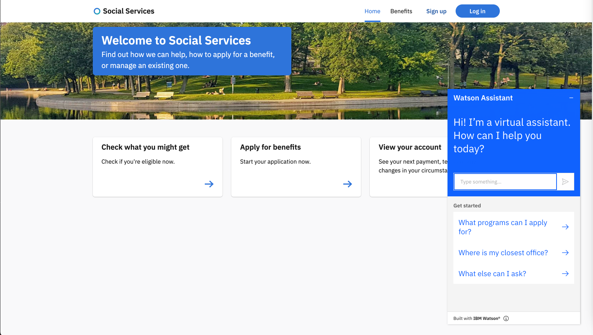

## Frequently Asked Questions (FAQs)

The Virtual Assistant for the citizen has been trained to answer questions on the following topics:
* Your account
    * How to create an account
    * Forgot passowrd
    * How to upload documents
* Applications and Benefits
    * How to apply for benefits
    * How to determine potential eligibility
* Office locator using Google maps

## Google Maps

The Watson Assistant web chat widget has a feature to display an embedded iframe as a hyperlink, which then expands once clicked upon to display any given map.  The default map chosen for the asset is Google Maps.  In order to use the same dialog node as is, you must obtain your own Google API Key and update the node "Map Office By Zip Code".

