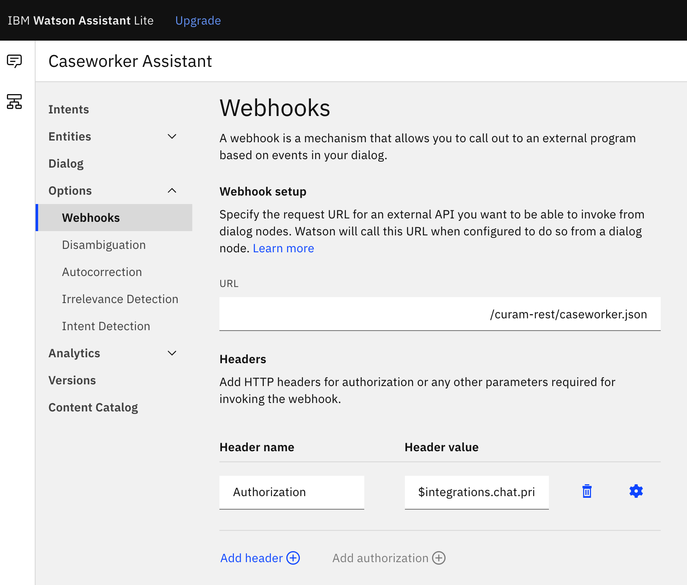

The default webhook configurations will require an update to point to your new IBM Cloud Functions URL that you copied from the `caseworker` function.

The following steps outline how to update the default webhook configurations:

1. Go to your IBM Watson™ Assistant.
2. Click `Options>Webhooks` on the left side and paste the URL into the `URL` input box.

    

    <Caption fullWidth>

    *Figure 1: Watson Assistant Webhooks.*

    </Caption>

3. Note: you need to add a `“.json”` to the URL so that Watson recognizes that you are returning a JSON snippet.

An authorization header is automatically added. The configuration is added to secure the web chat to authenticate the webhook calls by passing the JSON Web Token (JWT) as part of the request.

For more information, see [Web chat: Reusing the JWT for webhook authentication](https://cloud.ibm.com/docs/assistant?topic=assistant-dialog-integrations#dialog-integrations-chat-jwt).
