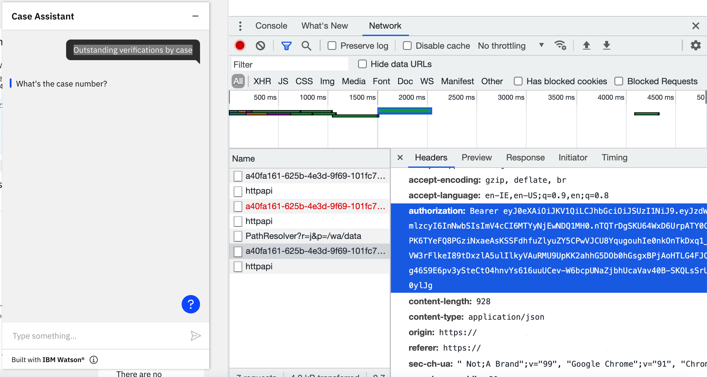
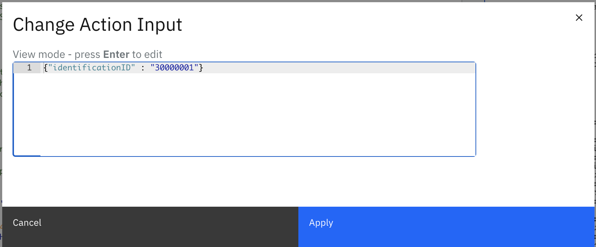
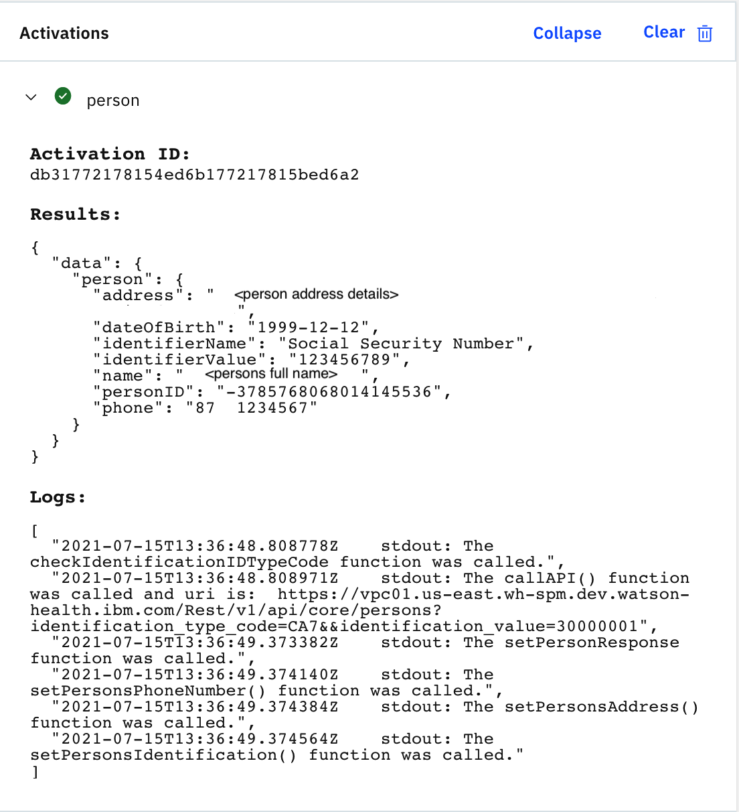
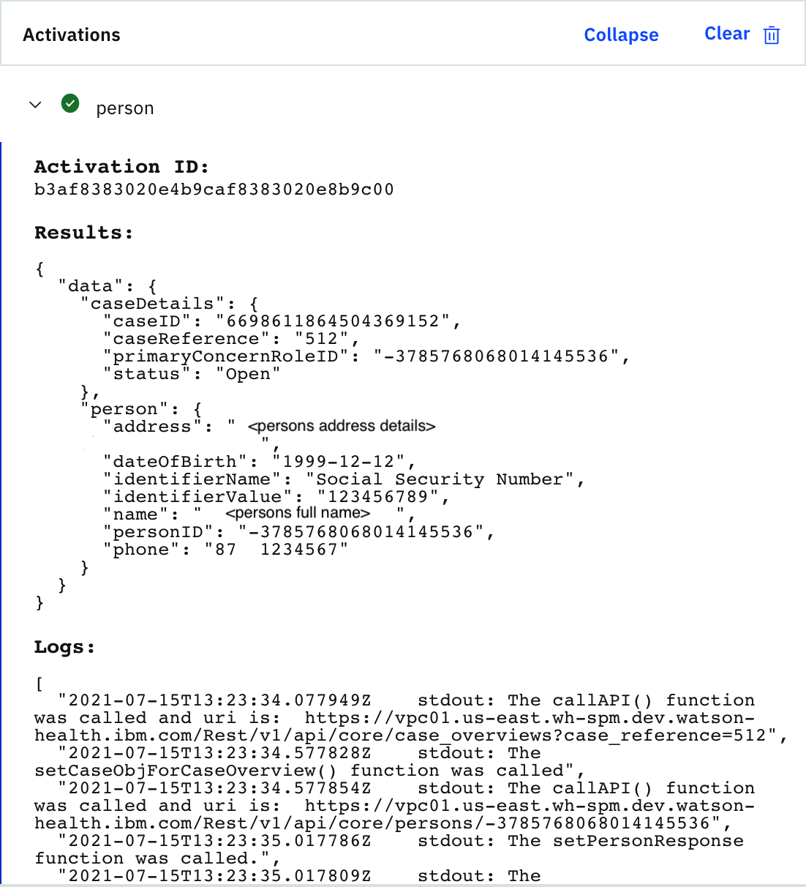
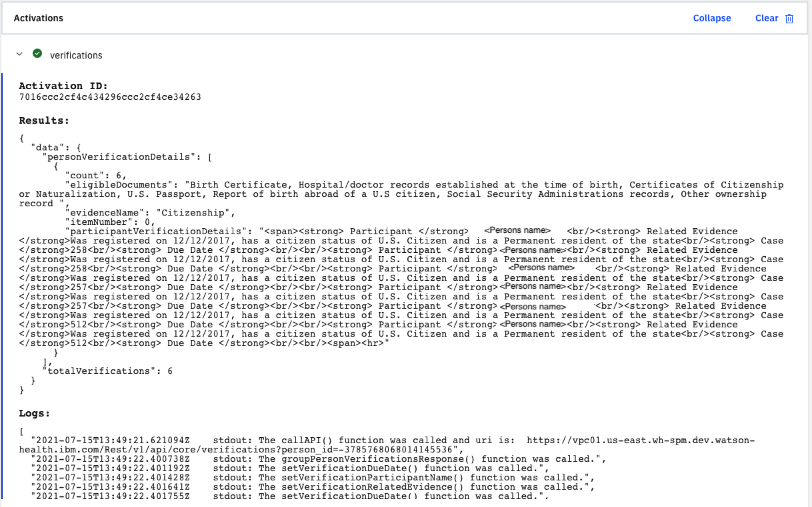
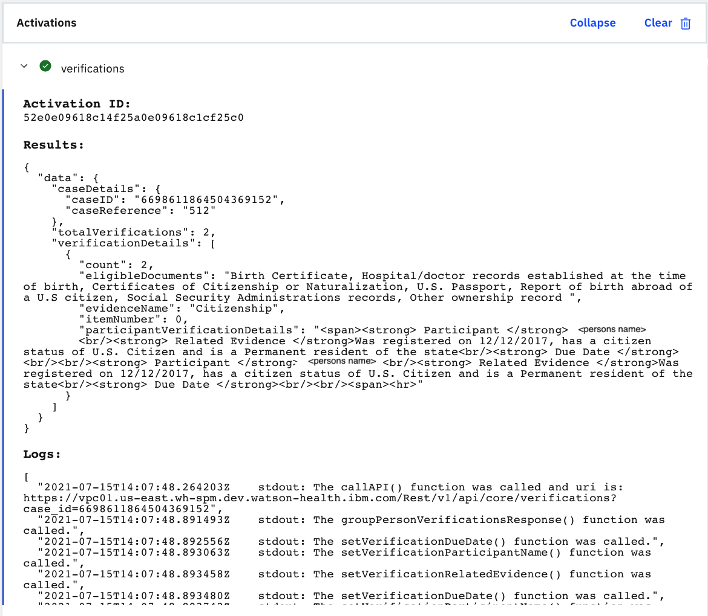
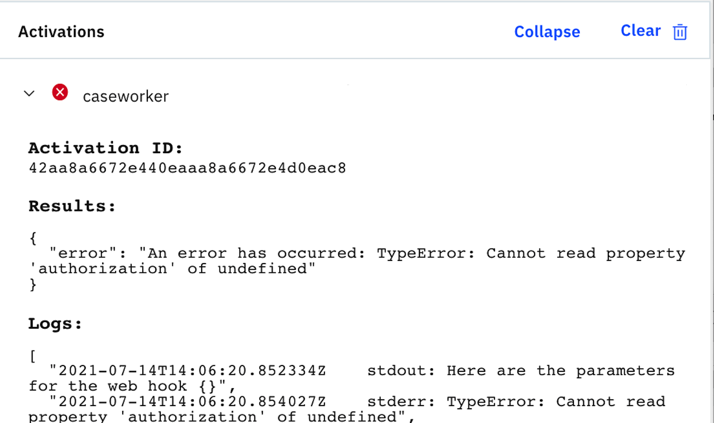
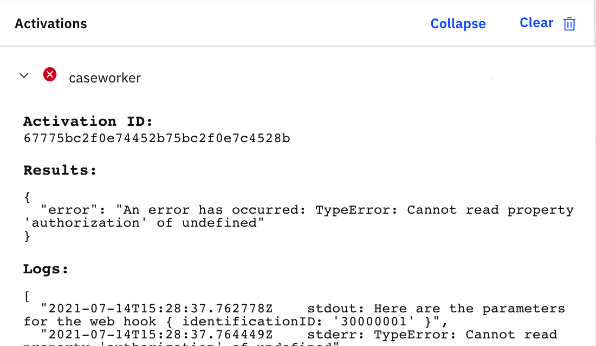
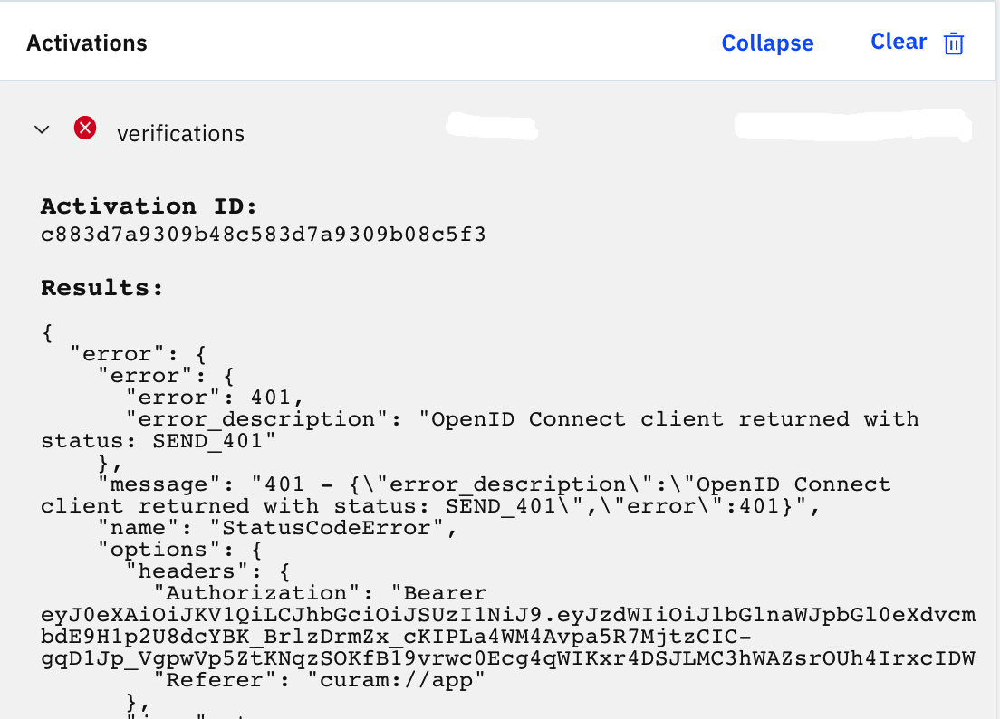

<u>Table of Contents</u>

* [Start the action](#start-the-actions)
  * [Start flows](#start-flows)
    * [Start with parameters](#start-with-parameters)
  * [Start Person or verifications actions](#start-person-or-verifications-actions)
* [Sample expected results](#sample-expected-results)
* [Troubleshooting issues](#Troubleshooting-issues)
  * [No parameter entered](#no-parameter-entered)
  * [Authorization issue](#authorization-issue)
  * [Authorization expired](#authorization-expired)
  * [Not able to view end of the logs](#not-able-to-view-end-of-the-logs)

## Start the Actions

As part of the IBM Cloud Functions service, you can run each of the actions that are created to view the expected JSON or HTML format that is outputted as part of each request.

You might want to modify the existing sample Java script code that is provided to call your own custom REST APIs or display different fields in the chatbot based on your own requirements.

Before you start the `caseworker` IBM Cloud Functions action, you need to update the authorization to include a valid bearer token where you can retrieve from the server.

The following list outlines how to update the authorization to include a valid bearer token where you can retrieve from the server:

1. From your server, log in with the user that you enabled to be displayed as the virtual assistant for example, `caseworker`.
2. From your browser > `Developer Tools`, open the `Network` section and select the clear icon.
3. Open the `Virtual Assistant` web chat and select `Outstanding verifications by case`.
4. From the Request Header on the request, you can copy the value for the `authorization`.

    

    <Caption>

    *Figure 1: Authorization.*

    </Caption>

5. From the `caseworker` action javascript code, comment out the following line:

    ```shell
    //const authorization = 'Bearer ' + params.__ow_headers.authorization;`. 
    ```

    The authorization is passed through as part of the webhook header configurations.

6. You need to put the line back in when you are testing directly with the application.

7. Remove the line that you add as part of step 6.

8. Create a new const and paste the bearer token value from the server. For example:

    ```
    const authorization = 'Bearer eyJ0eXAi...';
    ```

### Start flows

The `caseworker` action is the main action that calls into the `person` and `verifications` actions to retrieve the required data to be sent back to be displayed in the web chat window.

There are currently four different flows available in the sample actions that call out to the external system to retrieve the information.

The four flows can be started directly by using the `caseworker` action or else you can use the `person` or `verification` actions to run the individual flows.

The following steps outline how to start the four flows:

1. From `Functions` > `Actions` > `curam-rest` package, select the  `caseworker` function.
2. From the `Code` left navigation section of the page, select `Invoke with parameters` and enter one of the following parameters depending on the flow that you want to test out and click `Save`.

The following table lists the four different flows available in the sample actions:

| Flow | Start with parameters | Description |
| :-------------- | :------ |:------ |
| Retrieve Person details  | ```{"identificationID" : "<identificationID>"}``` | You can retrieve the `identificationID` which is also known as the `alternateID` from the Persons evidence page. The default identification type code is set to `CA7`, which is a `Reference Number`. If you want to test out other identification types by starting through the function, you will need to update the `Invoke with parameters` to include the type for example, by using the SSN identification type ```{"identificationID" : "<identificationID>", "identificationIDTypeCode": "CA1"}```.  
| Retrieve Person verification details | ```{"personID" : "<personID>"}``` | You can retrieve the personID, which is also known as the `concernRoleID` from the person home page if you have the [7. SPM UI Inspector](#7-spm-ui-inspector) tool configured. |
| Retrieve Person details for a case | ```{"caseReference" : "<caseReference>"}``` | You can view the case reference number when you selected the Integrated Case that is created in the system. |
| Retrieve case verification details  | ```{"caseID" : "<caseID>"}``` | You can retrieve the caseID from the case home page if you have the [7. SPM UI Inspector](#7-spm-ui-inspector) tool configured.  |

#### Start with parameters

The following steps outline how to start with parameters:

1. Click the `Invoke with parameters` button.
2. From the `Change Action Input` window, enter one of the sample parameters and click `Apply`.



<Caption>

*Figure 2: Start with parameters.*

</Caption>

### Start person or verifications actions

To troubleshoot, run the `person` or `verifications` flows directly to add more `console.log()` outputs to troubleshoot if things are not working as you expected.

You need to update the `Invoke with parameters` to also include the `authorization` parameter to include the bearer token that is retrieved from the header request that is specified in [Invoke the Functions](#invoke-the-functions).

The following table lists the two flows for the `person` function that you can test.

| Person flows | Start with parameters |
| :-------------- | :------ |
|1. Retrieving the person details by using the identification identifier.| ```{"identificationID" : "<identificationID>, "authorization": "Bearer xyz..."}```
|2. Retrieving the person details by using the case reference number.| ```{"caseReference" : "<caseReference>","authorization": "Bearer xyz..."}```|

The following table lists the two flows for the `verifications` function that you can test.

| Verifications flows | Start with parameters |
| :-------------- | :------ |
|1. Retrieving the person verification details by using the person identifier.| ```{"personID" : "<personID>, "authorization": "Bearer xyz..."}```
|2. Retrieving the case verification details by using the case identifier.| ```{"caseID" : "<caseID>","authorization": "Bearer xyz..."}```|

## Sample expected results

The following figures include some sample results retrieved by starting the different flows based on sample data that is configured in the application.



<Caption>

*Figure 3: Person results by using the identification number.*

</Caption>



<Caption>

*Figure 4: Person results by using the case reference number.*

</Caption>



<Caption>

*Figure 5: Verification results by using the person number.*

</Caption>



<Caption>

*Figure 6: Verification results by using the case number.*

</Caption>

## Troubleshooting issues

### No parameter entered

The following results are received if you do not add any parameters as part of the `Invoke with parameter` button and just click `Invoke`:

```
Results:
{
  "error": "An error has occurred: TypeError: Cannot read property 'authorization' of undefined"
}
```



<Caption>

*Figure 7: No parameter entered.*

</Caption>

Use the sample parameters provided in [Invoke flows](#invoke-flows).

### Authorization issue

The following results are received if you omitted steps 5 and 6 in the [Invoke the Functions](#invoke-the-functions).

```
Results:
{
  "error": "An error has occurred: TypeError: Cannot read property 'authorization' of undefined"
}
```



<Caption>

*Figure 8: Authorization issue.*

</Caption>

### Authorization expired

The following results are received when the authorization is expired.

```
Results: 
      "error": 401,
      "error_description": "OpenID Connect client returned with status: SEND_401"
```



<Caption>

*Figure 9: Authorization expired.*

</Caption>

You need to perform an action in the web chat window and copy the new authorization bearer token from the header request.

### Unable to view end of the logs

To view all the logs outputted, the scroll appears to scroll between the transactions and does not allow you to view the end of the logs outputted for the individual transactions.

To view all the logs, highlight the end of the logs that are shown and press SHIFT + Down Arrow. You can now scroll down by using the keyboard to view all the logs that are outputted for that transaction.
