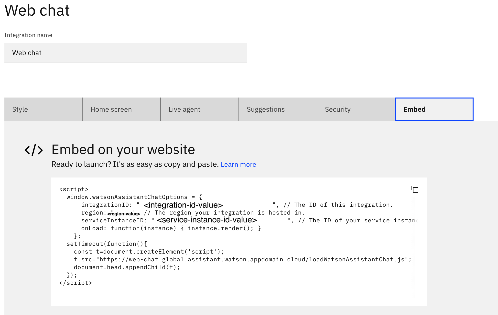
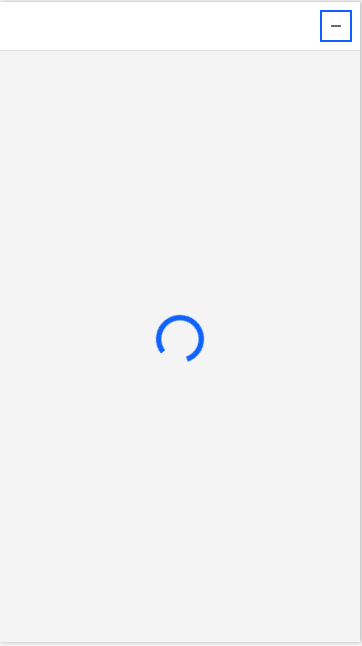
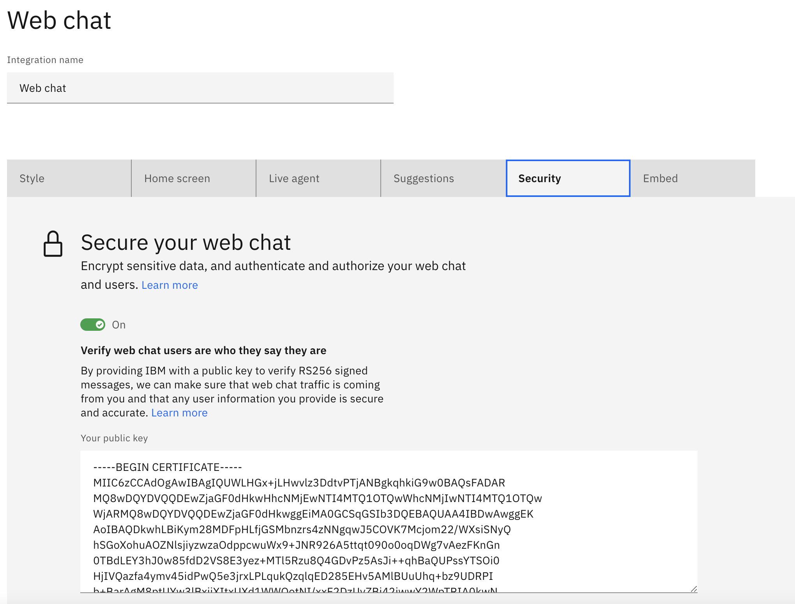
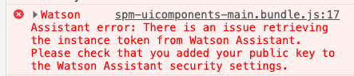
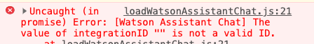
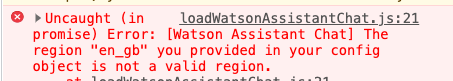

The following list gives solutions for some common issues you may encounter when displaying the chatbot in SPM:

* [The chatbot is not displaying on Curam SPM pages](#the-web-chat-is-not-displaying-on-curam-pages)
* [How to retrieve Watson Assistant instance and service IDs](#how-to-retrieve-watson-assistant-instance-and-service-IDs)
* [The Watson Assistant chatbot does not start](#the-watson-assistant-chatbot-does-not-start)
* [Browser console common errors](#browser-console-common-errors)
  * [The public cert is not added to my Watson Assistant](#the-public-cert-is-not-added-to-my-watson-assistant)
  * [Incorrect settings specified](#incorrect-settings-specified)

## The chatbot is not displaying on Curam SPM pages

If the chatbot is not displaying on Curam SPM pages, ensure that you follow the instructions for [integrating with Watson Assistant](https://www.ibm.com/docs/en/spm/8.0.0?topic=applications-integrating-watson-assistant).

## How to retrieve Watson Assistant instance and service IDs

The following list outlines the steps for configuring the Watson Assistant settings:

1. Follow the instructions for [configuring the Watson Assistant settings](https://www.ibm.com/docs/en/spm/8.0.0?topic=assistant-configuring-watson-settings) in the system administration workspace.
2. Retrieve the setting from your Watson Assistant > `Integratations` > `Web chat`.
3. Click the `Embed` tab to retrieve the values for the `integrationID`, `region` and `serviceInstanceID`.

<Caption fullWidth>

*Figure 1: The Watson Assistant settings.*

</Caption>

## The Watson Assistant chatbot does not start

If the Watson Assistant chatbot does not start, delete the JWT certificate and the associated jar in your JAVA_HOME directory. Then, rerun the build targets to re-create the `jwtcert.cer` and the `JWTCryptoConfig.jar` files.

<Caption fullWidth>

*Figure 2: The Watson Assistant chatbot when it is spinning.*

</Caption>

The following list outlines the steps for creating the JWT configuration files.

1. From the `JAVA_HOME/jre/lib/ext` directory, delete the `jwtcert.cer` and the `JWTCryptoConfig.jar` files.
2. Run the build `configtest` target that is specified in [generating the JWT keystore and certificates](https://www.ibm.com/docs/en/spm/8.0.0?topic=assistant-generating-jwt-keystore-certificates).
This will generate a new keystore and self-signed certificate.
3. Follow the steps for [adding the public key to Watson Assistant](https://www.ibm.com/docs/en/spm/8.0.0?topic=certificates-adding-public-key-watson-assistant).
4. If the public certificate was already imported into the application server's truststore, follow the steps to [re-import the public certificate](https://www.ibm.com/docs/en/spm/8.0.0?topic=assistant-configuring-application-servers-json-web-tokens).
This applies to deployments on IBM Websphere and IBM Websphere Liberty only.

<Caption fullWidth>

*Figure 3: Adding the public key to the Watson Assistant web chat security.*

</Caption>

## Browser console common errors

When you view the IBM Watson Assistant chatbot in your browser window, it is useful to open up the browser console window to view any logs that are outputted.

### The public cert is not added to my Watson Assistant

If the public cert is not added to Watson Assistant, follow the steps for [adding the public key to Watson Assistant](https://www.ibm.com/docs/en/spm/8.0.0?topic=certificates-adding-public-key-watson-assistant).

<Caption fullWidth>

*Figure 4: The public key is missing in the Watson Assistant web chat security.*

</Caption>

### The incorrect settings are specified

When you update the Watson Assistant settings in the system administration workspace, you might inadvertently miss a setting or add the wrong value. The browser console specifies an error if the browser  detects any issues.

<Caption fullWidth>

*Figure 5: The IntegrationID is missing.*

</Caption>

<Caption fullWidth>

*Figure 6: The region is set incorrectly.*

</Caption>
