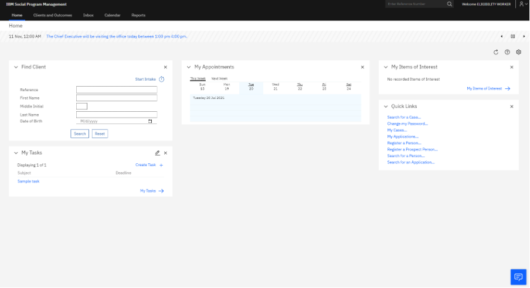
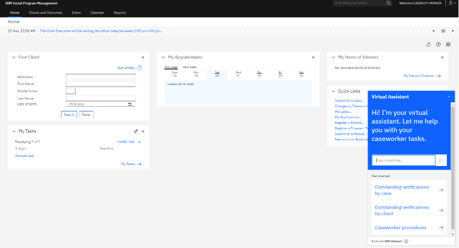
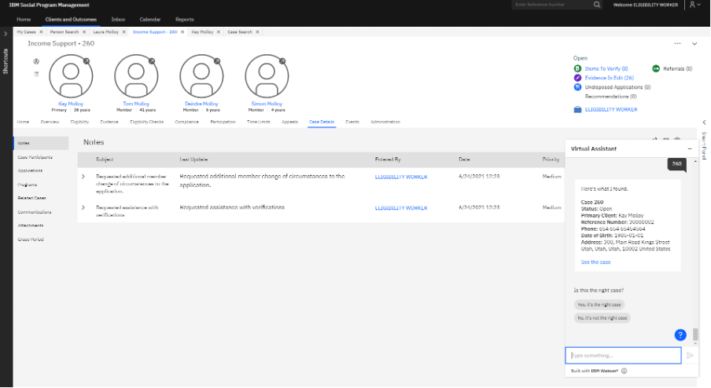

<u>Table of Contents</u>

* [Overview](#overview)
* [Shortcuts](#shortcuts)
* [Getting started](#getting-started)
* [Searching for outstanding verifications by case](#searching-for-outstanding-verifications-by-case)
  * [Free text a question, case reference or number into the text field](#free-text-a-question-case-reference-or-number-into-the-text-field)
  * [Click the Outstanding verifications by case option](#click-the-outstanding-verifications-by-case-option)
* [Searching for outstanding verifications by client](#searching-for-outstanding-verifications-by-client)
  * [Free text a question, identification type or number into the text field](#free-text-a-question-identification-type-or-number-into-the-text-field)
  * [Click the Outstanding verifications by client option](#click-the-outstanding-verifications-by-client-option)
* [Searching for assistance with caseworker procedures](#searching-for-assistance-with-caseworker-procedures)
  * [Free text a question around procedures into the text field](#free-text-a-question-around-procedures-into-the-text-field)
  * [Click the Caseworker procedures option](#click-the-caseworker-procedures-option)
  
## Overview

The following list outlines the two ways that the Virtual Assistant is designed to assist caseworkers:

1. Querying data by searching for outstanding verifications by case or by client.
2. Understanding caseworker procedures related to updating client details for a change in income or address.

The following lists the two ways that the user can engage with the Virtual Assistant:

* The user can type a free text question, case reference and number or identification type and number into the text field.
* The user can click one of the options that are provided by the Virtual Assistant that prompts the user to enter more information about what they want to find.

The Virtual Assistant can recognize different variations of how users enter information.

## Shortcuts

The following list outlines shortcuts that users can use with the Virtual Assistant:

* `Ctrl+F` to find specific text in the Virtual Assistant responses.
* Click the blue question mark icon to get a list of original options.
* Type `Help` to get a quick guide on how to use the Virtual Assistant.
* Type an identification number and text, such as `case`, `client`, `SSN`, `driver`, `license`, or `passport`, to see verifications.
* Type `Add income` or `Add address` for steps about how to add new income or address evidence.
* Type `Edit` for steps about how to edit evidence.
* Type `Verify` for steps about how to add proof for an outstanding verification. For example, to add proof of income.
* Type `Share` for steps about how to share evidence.

## Getting started

The Virtual Assistant is displayed as a blue icon and is located in the lower right of the application.

When the user clicks the icon, the Virtual Assistant is launched. The minimize icon in the upper right collapses the Virtual Assistant screen when the screen is not in use.

<Caption>

*Figure 1: The Virtual Assistant on the application.*

</Caption>

When the Virtual Assistant is open, the user can engage with it in two ways. The following list outlines the ways that the user can engage with the Virtual Assistant:

* The user can type a free text question, case reference and number or identification type and number into the text field.
* The user can click one of the options in the Get started section, `Outstanding verifications by case`, `Outstanding verifications by client` or `Caseworker procedures`.

Each option prompts the user to enter more information about what they want to find.

The Virtual Assistant can recognize different variations of how users enter information. If the user is searching by using free text, the user must attempt another variation if the Virtual Assistant does not recognize the user's input.

<Caption>

*Figure 2: The Virtual Assistant get started section.*

</Caption>

During the chat session, there is a blue question mark icon in the lower left. Clicking the blue question mark icon provides the user with the original set of options that are provided by the Virtual Assistant at the start of the chat.

The following list outlines the set of options that are displayed:

* Outstanding verifications by case.
* Outstanding verifications by client.
* Caseworker procedures.

<Caption>

*Figure 3: The Virtual Assistant blue question mark icon displayed.*

</Caption>

## Searching for outstanding verifications by case

Users can view outstanding verifications on a case in two ways.

### Free text a question, case reference or number into the text field

In the example where a user is seeking an Integrated Case number 260, the user can type this information in the text field. The Virtual Assistant can recognize different variations of how the user enters this information.

For example, the user might type it as `260 Integrated Case`, `IC 260`, `Case 260`, `260 Case Ref`. Similarly, the user might type it as a question.

For example, `Show me outstanding verifications for IC 260?`, `What needs to be verified for Integrated Case 260?`, `Can I see verifications on Case 260?`, and many other variations of the information and question.

The Virtual Assistant displays the case that is found by using the information that is provided. The user must then select whether it is the correct case.

If the user clicks `Yes, it's the right case` the outstanding verifications on this case are displayed in the chat window. In addition to listing the outstanding verifications on the case, the Virtual Assistant has options that the user can click.

The following list outlines the options that are displayed:

* See outstanding verifications for case 260.
* See notes for case 260.

When the user clicks either option, the page opens in the application.

If the user wants to continue to use the Virtual Assistant, the user can type another question or entity type and number or else click one of the provided options.

The following list outlines the options that are displayed to the user:

* Try another case.
* Start again.
* I've got what I need thanks.

The three options are also provided if the case that is displayed by the Virtual Assistant is not the correct case.

### Click the Outstanding verifications by case option

By clicking the Outstanding verifications by case option, the Virtual Assistant is prompted to ask for the case number the user is searching for.

When the user enters the case number, the Virtual Assistant displays the case that it finds by using the information that is provided and the user must then select whether it is the correct case.

If the user clicks `Yes, it's the right case`, the outstanding verifications for this case are displayed in the chat window. In addition to listing the outstanding verifications on the case, the Virtual Assistant displays options that the user can click.

The following list outlines the options that are displayed to the user:

* See outstanding verifications for case 260.
* See notes for case 260.

When the user clicks either option, the page opens in the application. If the user wants to continue to use the Virtual Assistant, the user can type another question or entity type and number or else click one of the provided options.

The following list outlines the options that are displayed to the user:

* Try another case.
* Start again.
* I've got what I need thanks.

The three options are also provided if the case displayed by the Virtual Assistant is not the correct case.

## Searching for outstanding verifications by client

Users can view outstanding verifications for a client in two ways.

### Free text a question, identification type or number into the text field

In the example where a user is searching for a client by using a passport number, the user can type this information in the text field. The Virtual Assistant can recognize different variations of how this information is entered.

For example, the user might type it as `Passport 20001`, `Pass 20001`. Similarly, the user might type it as a question.

For example, `Show me outstanding verifications for Passport 20001`, `What needs to be verified for pass 20001?`, or `Can I see verifications on Passport 20001?` and many other variations of the question.

If the user is searching by using free text, the user must attempt another variation if the Virtual Assistant does not recognize the user's input.

When the text is entered, the Virtual Assistant displays the client that it found by using the information that is provided and the user must then click whether it is the correct client.

If the user clicks `Yes, it's the right client`, the outstanding verifications for this client are displayed in the chat window. In addition to listing the outstanding verifications for the client, the Virtual Assistant displays options the user can click.

The following list outlines the options that are displayed to the user:

* See client home.
* See client notes.

When the user clicks either option, the page opens in the application.

If the user wants to continue to use the Virtual Assistant, the user can type another question or entity type and number or else click one of the provided options.

The following list outlines the options that are displayed to the user:

* Try another client.
* Start again.
* I've got what I need thanks.

The three options are also provided if the client displayed by the Virtual Assistant is not the correct client.

### Click the Outstanding verifications by client option

By clicking the `Outstanding verifications by client` option, the Virtual Assistant is prompted to display `Which identification number do you want to use? SSN, Driver's license, Passport, Reference number`.

The user must then click or type the identification number that the user wants to use, which prompts the Virtual Assistant to request the number.

When the user enters the number, the Virtual Assistant displays the client that the Virtual Assistant found by using the information that the user provided.

The user must then click if it is the correct client. If the user clicks `Yes, it's the right client`, the outstanding verifications for this client are displayed in the chat window.

In addition to listing the outstanding verifications for the client, the Virtual Assistant displays options the user can click to `See client home` and `See client notes`. When the user clicks either option, the page opens in the application.

If the user wants to continue to use the Virtual Assistant, the user can type another question or entity type and number or else click one of the provided options.

The following list outlines the options that are displayed to the user:

* Try another client.
* Start again.
* I've got what I need thanks.

The three options are also provided if the client displayed by the Virtual Assistant is not the correct client.

## Searching for assistance with caseworker procedures

The following list outlines the four procedures that the Virtual Assistant can help users with by providing step by step guides:

1.	Adding evidence.
2.	Editing evidence.
3.	Verifying evidence.
4.	Sharing evidence.

Users can view caseworker procedures in two ways.

### Free text a question around procedures into the text field

The user can type the procedure that the user wants help with. The Virtual Assistant can recognize different variations of the information that the user enters.

If the user is searching by using free text, the user must attempt another variation if the Virtual Assistant does not recognize the user's input.

The following list outlines examples of what users can type to find guidance on the four procedures:

* Type `Add income` or `Add address` for steps about how to add new income or address evidence.
* Type `Edit` for steps about how to edit evidence.
* Type `Verify` for steps about how to add proof for an outstanding verification. For example, to add proof of income.
* Type `Share` for steps about how to share evidence.

Further options are provided about how to proceed. The following list outlines the options that the user can click:

* Continue working with Caseworker procedures.
* Start again.

### Click the Caseworker procedures option

By clicking the Caseworker procedures option, the Virtual Assistant is prompted to display five options. The following list outlines the five options that are displayed:

* Type a question or select an option.
* Adding evidence.
* Editing evidence.
* Verifying evidence.
* Sharing evidence.

The user can type or click what the user is seeking assistance with for a step by step guide about how to perform a procedure for either income or address evidence.

Further options are provided about how to proceed. The following list outlines the options that the user can click:

* Caseworker procedures.
* Start again.
